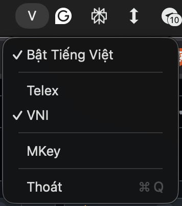

# HKey Telex

Bộ gõ tiếng Việt cho macOS — fork từ [Mkey](https://github.com/mantrandev/Mkey), bản thân Mkey fork từ [OpenKey](https://github.com/tuyenvm/OpenKey). Stripped down cho cá nhân.

## Tải về

[**HKey-telex-v0.0.4.dmg**](https://github.com/mantrandev/HKey/releases/tag/telex-v0.0.4)

## Screenshot



## Tính năng

- **Kiểu gõ:** Telex (cố định, không có toggle)
- **Bảng mã:** Unicode
- **Phím tắt chuyển ngôn ngữ:** `Ctrl + Space`
- **Menu bar SwiftUI** — hiển thị `H` (tiếng Việt) hoặc `E` (tiếng Anh)

## Yêu cầu

macOS 14.0+.

**Gatekeeper:** Vì app chưa được notarize, cần bỏ chặn thủ công sau khi cài:  
*System Settings → Privacy & Security* → tìm `HKey` → bấm **Open Anyway**.

**Accessibility:** Cấp quyền để app hoạt động:  
*System Settings → Privacy & Security → Accessibility* → bật `HKey`.

**Text Input:** Để HKey hoạt động mượt, chỉ giữ **một** input source là `U.S.` (English) trong *System Settings → Keyboard → Text Input → Input Sources*. Xoá hết các input source tiếng Việt (Telex/VNI) của macOS — HKey tự xử lý phần gõ.


## Cài đặt

**Homebrew (khuyến nghị):**

```bash
brew tap mantrandev/tap
brew install --cask mantrandev/tap/hkey-telex
```

**Thủ công:**

1. Tải `HKey.dmg` từ [Releases](https://github.com/mantrandev/HKey/releases)
2. Mở DMG, kéo `HKey.app` vào thư mục `Applications`

**Sau khi cài (cả hai cách):**

1. Mở `HKey` — hệ thống sẽ yêu cầu cấp quyền Accessibility
2. Vào *System Settings → Privacy & Security → Accessibility* → bật `HKey`
3. Mở lại `HKey`

## Build

Mở `Sources/macOS/Mkey.xcodeproj`, chọn scheme `Mkey`, build. Target và scheme vẫn giữ tên `Mkey`; app build ra là `HKey.app` qua `PRODUCT_NAME`.

- **Debug:** bundle ID `com.mantrandev.mkey.dev`
- **Release:** bundle ID `com.mantrandev.mkey`

Bundle ID giữ nguyên `mkey` để bản cài sẵn không bị mất quyền Accessibility và cấu hình đã lưu.

Đóng gói DMG:

```bash
./build.sh
```

## Icon

App icon sinh từ vector, không sửa `.icns` bằng tay:

```bash
./design/make-icon.sh
```

Script render `design/Icon.svg` qua Chrome headless ở đủ 10 kích cỡ của iconset (16→1024) rồi `iconutil` đóng thành `Sources/macOS/ModernKey/Resources/Icon.icns`. Sửa icon thì sửa SVG rồi chạy lại script.
